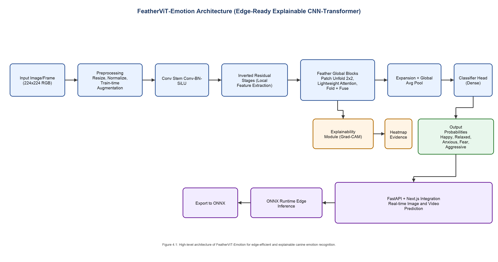

# FeatherViT-Emotion

> **Edge-Ready, Explainable CNN-Transformer for Canine Emotion Recognition**

FeatherViT-Emotion is a family of ultra-lightweight hybrid CNN-Transformer models purpose-built for real-time emotion classification in dogs. Designed with edge deployment in mind, it combines the local feature extraction power of inverted residual convolutional stages with a novel **Feather Global Block** — a 2×2 patch-unfolding lightweight attention mechanism — to deliver high accuracy at minimal parameter cost.

The model produces both **emotion predictions** and **Grad-CAM visual explanations**, and ships ready for export to **ONNX** for edge or server deployment via a **FastAPI + Next.js** application stack.

---

## Architecture

<p align="center">
  
</p>

<p align="center"><em>Figure: High-level architecture of FeatherViT-Emotion for edge-efficient and explainable canine emotion recognition.</em></p>

The pipeline flows as follows:

| Stage | Description |
|---|---|
| **Input** | 224×224 RGB image or video frame |
| **Preprocessing** | Resize, Normalize, Train-time Augmentation |
| **Conv Stem** | Conv → BN → SiLU |
| **Inverted Residual Stages** | Local feature extraction (MobileNet-style) |
| **Feather Global Blocks** | Patch Unfold 2×2, Lightweight Attention, Fold + Fuse |
| **Expansion + Global Avg Pool** | Dimensionality expansion and spatial pooling |
| **Classifier Head** | Dense layer → emotion probabilities |
| **Explainability Module** | Grad-CAM heatmap evidence |
| **ONNX Export** | ONNX Runtime edge inference |
| **App Integration** | FastAPI + Next.js real-time image/video prediction |

**Output emotions:** `Happy` · `Relaxed` · `Anxious` · `Fear` · `Aggressive`

---

## Repository Structure

```text
FeatherViT-Emotion/
└── FeatherViT-Emotion-XXS/          # XXS variant — standalone package
    ├── feathervit_emotion/
    │   ├── model.py                 # Model definition
    │   ├── data.py                  # Dataset & augmentation pipeline
    │   ├── train.py                 # End-to-end training loop
    │   ├── evaluate.py              # Validation / test evaluation
    │   ├── predict.py               # Single-image top-k inference
    │   ├── export.py                # TorchScript + ONNX export
    │   ├── benchmark.py             # Synthetic throughput/latency profiler
    │   ├── count_params.py          # Parameter counter
    │   └── utils.py                 # Shared utilities
    ├── configs/                     # YAML experiment presets
    ├── scripts/                     # Convenience shell scripts
    ├── images/                      # Architecture diagrams
    ├── requirements.txt
    └── README.md                    # Package-level docs
```

---

## Model Variants

| Variant | Parameters (4-class) | Parameters (1000-class) |
|---|---|---|
| **FeatherViT-Emotion-XXS** | 0.953 M | 1.273 M |

---

## Requirements

- Python `3.10+`
- macOS / Linux / Windows
- Optional: GPU (`cuda`) or Apple Silicon (`mps`)

```bash
python3 -m venv .venv
source .venv/bin/activate          # Windows: .venv\Scripts\activate
pip install --upgrade pip
pip install -r FeatherViT-Emotion-XXS/requirements.txt
```

**Core dependencies:**

```
torch>=2.1.0
torchvision>=0.16.0
Pillow>=10.0.0
tqdm>=4.66.0
numpy>=1.26.0
onnx>=1.15.0
```

---

## Quick Start

### 1 · Dataset Layout

Expects standard `torchvision.datasets.ImageFolder` format:

```text
dataset_root/
  train/
    happy/
    relaxed/
    anxious/
    aggressive/
  valid/
    happy/
    ...
  test/       # optional
```

### 2 · Train

```bash
python3 -m feathervit_emotion.train \
  --train-dir  "datasets/dog_emotion/train" \
  --val-dir    "datasets/dog_emotion/valid" \
  --output-dir "runs/feathervit_emotion_xxs_dog" \
  --epochs 80 \
  --batch-size 64 \
  --img-size 224 \
  --lr 5e-4 \
  --weight-decay 0.05 \
  --label-smoothing 0.1 \
  --dropout 0.2 \
  --seed 42 \
  --device cuda   # or mps / cpu
```

### 3 · Evaluate

```bash
python3 -m feathervit_emotion.evaluate \
  --val-dir    "datasets/dog_emotion/valid" \
  --checkpoint "runs/feathervit_emotion_xxs_dog/best.pt" \
  --batch-size 64 \
  --img-size 224 \
  --device cuda
```

### 4 · Predict (Single Image)

```bash
python3 -m feathervit_emotion.predict \
  --image      "/path/to/dog.jpg" \
  --checkpoint "runs/feathervit_emotion_xxs_dog/best.pt" \
  --img-size 224 \
  --topk 4 \
  --device cuda
```

### 5 · Export to ONNX / TorchScript

```bash
python3 -m feathervit_emotion.export \
  --checkpoint "runs/feathervit_emotion_xxs_dog/best.pt" \
  --output-dir "weights/exports" \
  --img-size 224
```

**Output artifacts:**

```
weights/exports/feathervit_emotion_xxs.onnx
weights/exports/feathervit_emotion_xxs.ts
```

### 6 · Benchmark (Throughput / Latency)

```bash
python3 -m feathervit_emotion.benchmark \
  --checkpoint "runs/feathervit_emotion_xxs_dog/best.pt" \
  --num-classes 4 \
  --img-size 224 \
  --batch-size 1 \
  --warmup 20 \
  --iters 200 \
  --device cuda \
  --amp
```

---

## CLI Reference

| Module | Description |
|---|---|
| `feathervit_emotion.train` | Train from scratch or resume from checkpoint |
| `feathervit_emotion.evaluate` | Evaluate checkpoint on validation / test split |
| `feathervit_emotion.predict` | Single-image top-k inference with class labels |
| `feathervit_emotion.export` | Export TorchScript and ONNX deployment artifacts |
| `feathervit_emotion.count_params` | Report total parameter count for a given class setup |
| `feathervit_emotion.benchmark` | Synthetic throughput and latency profiling |

---

## Preset Scripts

Convenience shell scripts are provided in `FeatherViT-Emotion-XXS/scripts/`:

```bash
bash scripts/train_mps_feathervit_emotion_xxs_dog_scratch.sh
bash scripts/eval_feathervit_emotion_xxs_dog.sh
bash scripts/export.sh
bash scripts/benchmark.sh
```

---

## Explainability

FeatherViT-Emotion includes a built-in **Grad-CAM explainability module** that generates heatmap overlays, allowing you to visualize which regions of the image the model uses to make its emotion prediction — critical for transparency in animal welfare applications.

---

## Deployment

The exported ONNX model integrates directly with the application backend:

```
FeatherViT-Emotion-XXS-App/
  backend/     ← FastAPI service (loads feathervit_emotion_xxs.onnx)
  frontend/    ← Next.js real-time image & video prediction UI
```

Recommended artifact path for the app:

```
weights/exports/feathervit_emotion_xxs.onnx
```

---

## Google Colab

For a full cloud training workflow (Drive mount, train, export, sync), refer to:

```
FeatherViT-Emotion-XXS/COLAB_TRAINING_FEATHERVIT_EMOTION_XXS.md
```

---

## License

This project is released for research and educational purposes. Please review individual component licenses before commercial use.

---

<p align="center">
  Built with ❤️ for edge-efficient, explainable AI in animal welfare.
</p>
